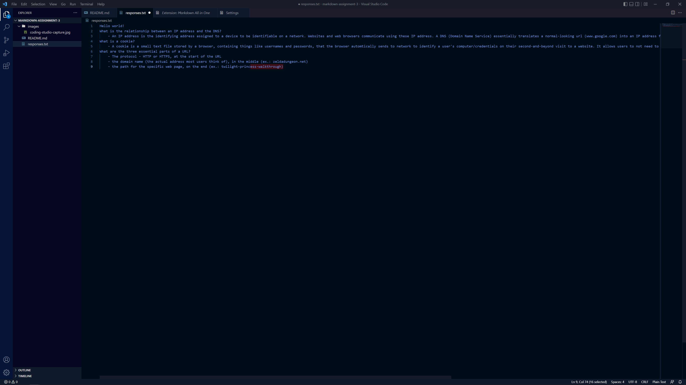

# README Assignemnt 3

3 Things I have learned in this class so far:
1. Learned what DNS actually is after having heard of it for a long time and not actually knowing
2. Learned that wi-fi and wireless internet is essentially just a really cool radio
3. Leanred exactly what cookies are after only understanding them as "that ease of use thing"

[Responses file](responses.txt)

