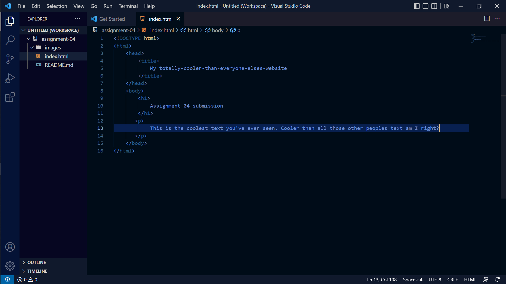

A web browser's main purpose is to process and display HTML so it is accesible and interactable to the user of said browser. They also, as discussed last week, handle security protocols like HTTP and HTTPS. I use Opera GX on my personal devices, but generally use Firefox at work (I work at UM IT.) Because I work in IT, I also use Chrome often for testing/while working on someone elses computer.

