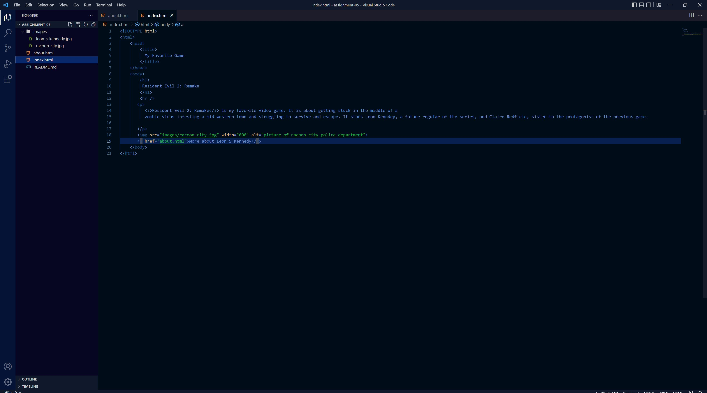

I visited a snapshot of zeldadungeon.net from back in 2004 - the earliest snapshot of the website. I visit it infrequently nowadays but still consider it the hub for Zelda walkthroughs and news. It was quite different in design - it looked like an old column-esque forum from back then, and the walkthroughs were much more personal. Instead of the journalist-style walkthrough that the site has nowadays, the snapshot held a short walkthrough accredited to a user with many emoticons and improper grammar. It was still charmful and informative but not nearly as navigable or efficient as nowadays.

