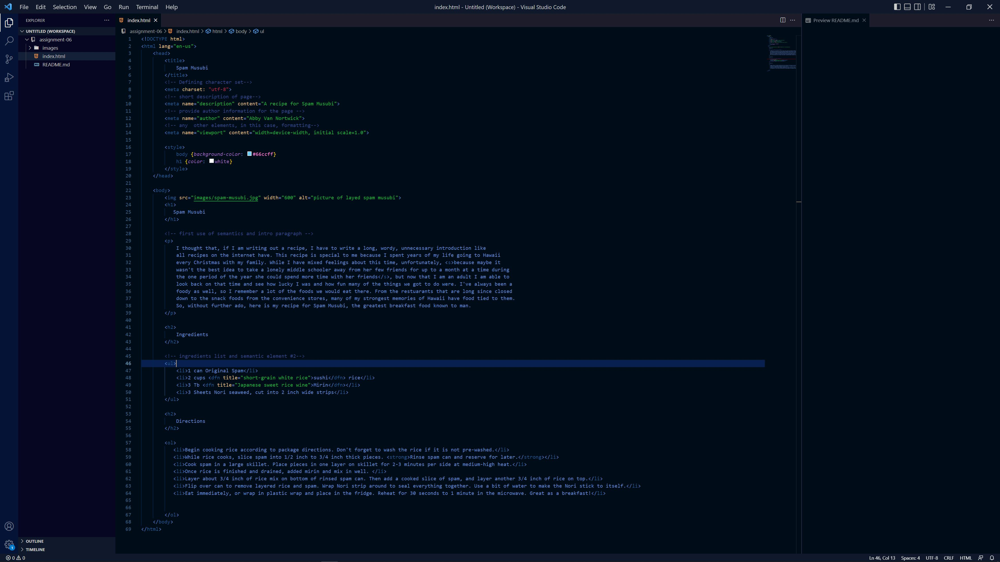

The difference between semantic and structual markup is that structual markup refers to the structure of the actual HTML code and metadata in the source code. It is referring to things like the body elements and other defining tags. It is usually only seen by the browser and is primarily for the browser to display the page properly. Semantic markup refers to elements that change the displayed text on a webpage, for any special cases like displaying quotes, addresses, etc. It is more to do with display than with code information.