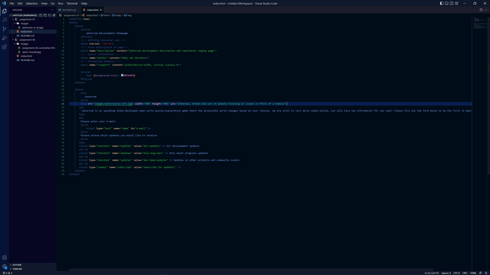

I have seen many different types of forms across the web. One of the ones that comes to mind is When2Meet, a website entirely dedicated to hosting forms for people to enter their free time in their schedules to determine a time that works for everyone to meet. That one is interesting not that I know some HTML because it seems like it is set up as a an interactive column format, not another standard form of selection. I see date formats a lot too, as described in the module. Plus, with how much Moodle I use, document uploads and large textboxes are seen a lot. These all serve the purpose of gathering information; in When2Meets case information on schedules, and in Moodle's case homework information created and submitted by students. All forms are about intaking, interpreting, and distributing data back to a server.