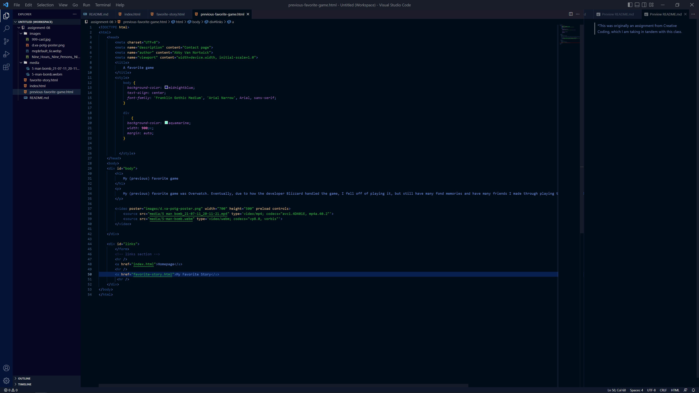

*Note: This was originally an assignment from Creative Coding, which I am taking in tandem with this class.

An affordance is the usage and clues to the usage of a digital interactive element, like a button, text field, drop-down menu, etc.

Adv. of a third-party hosting service:
    Great for a larger file that needs to be hosted, like long or high-quality video. And third-party services with handle encoding and compatability settings with browsers for you so you don't have to worry about it while coding.

Dis. of a third-party hosting service:
    Need to worry about copyright of content, and can be accidentally copyright claimed since bots do a lot of the reporting (just ask any youtuber), and it can become costly to host many large files.

It was a little challening to source a video to link to the assignment, but I realized I had a bunch of old Overwatch highlights sitting on my hard drive from my time on the UM Overwatch Esports team, so I used that!

