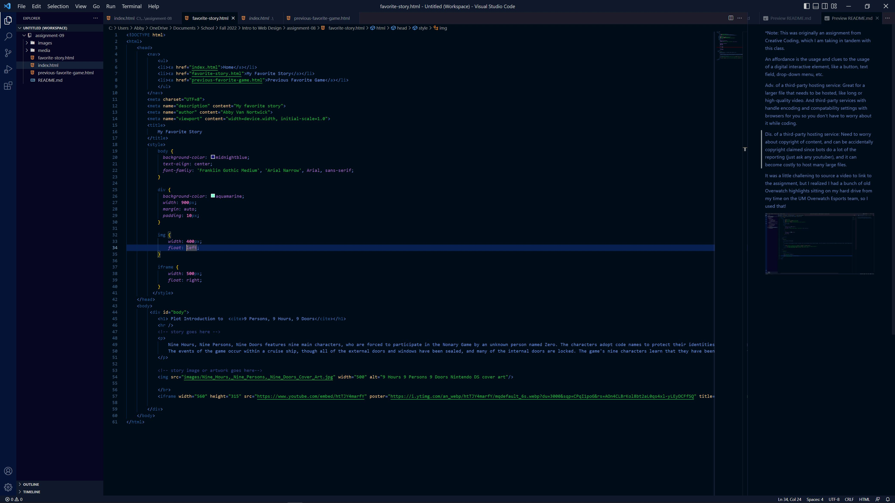

I was pleasantly surprised with HTML. I've had mixed experiences learning different coding languages in the past but I had a fun and relatively easy time learning HTML. I think I like that I get feedback instantly with HTML whereas with other languages you often have to write a lot of code before you even see anything resembling the final project. HTML let's you see your end product develop the whole way through.

I'm really excited to learn CSS! I like pretty websites and want to create my own, and am looking forward to how it will keep my HTML code cleaner when I have CSS style sheets.

