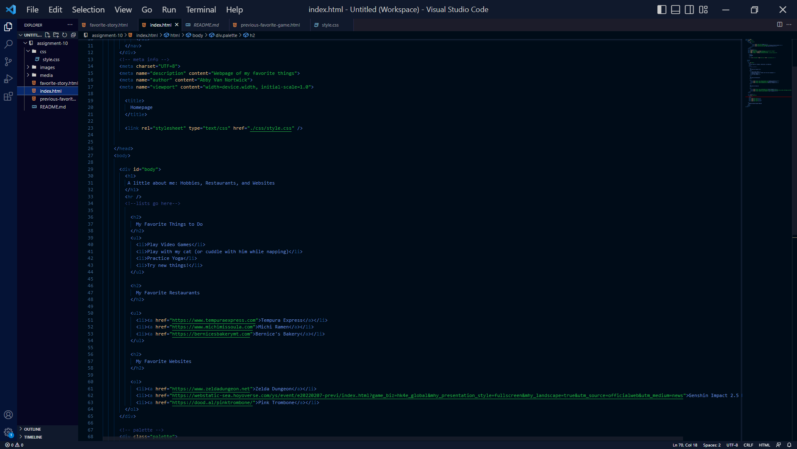

A universal selector applies to the entire HTML page. An element selector appliest to just a specific part of an HTML page (body, title, images, etc.)
Classes are used to select a group of elements/multiple elements within one HTML page. An ID is useed to select a single element on an HTML page (marks only one element on an HTML page.) Choosing which one of these four selectors to use depends on how the developer wants to structure the page layout and code, and how complex the page display is. If someone is making a simple page and just wants to jazz it up a little bit, a universal selector is perfect. If someone needs to add more to that, then element/class/ID selectors come in to be more specific about what exact area needs styling.

I choose my colors by using paletton, entering in my favorite color (Statos blue, or #000044) and looking at the suggested 3-color palettes. I also knew I needed a neutral background so I choose Ivory as a nice cold white.
