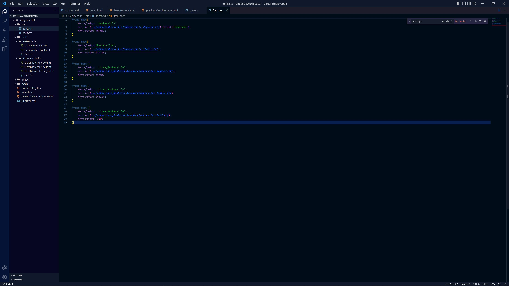

Typography is the art and science of arranging and formatting textual material. This can be physical like in a book or magazine, or in our case, digital like on a website or application. 

It is important to have fallback fonts just in case a browser or system cannot load a font. Not all fonts are shared between operating systems and applications, therefore backups are needed because we don't know how an end user will be accessing our data.

System font are those that are loaded onto a computers operating system. Web fonts are specifically for websites and so can be loaded on a web server for a site. Web-safe fonts are designed to be easily adaptable on any platform. They differ just in how available they are to a user depending on the user's system and web browser.