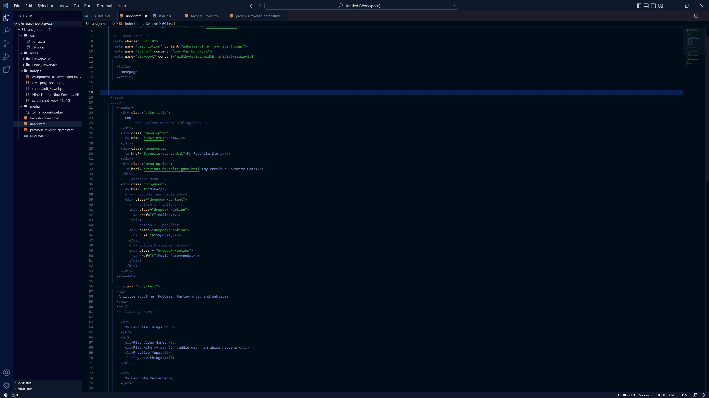

Border is the lines drawn around a piece of content on a webpage, usually square and usually visible, but can be invisible. Padding is the distance between the content within the border and said orders, Whereas a margin is the distance between borders for two different pieces of content.